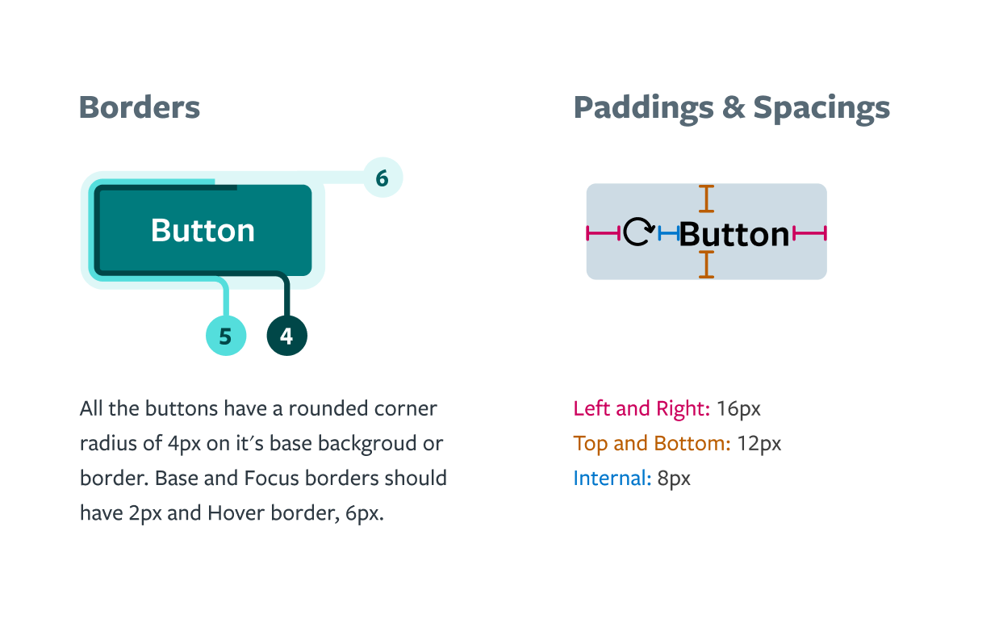
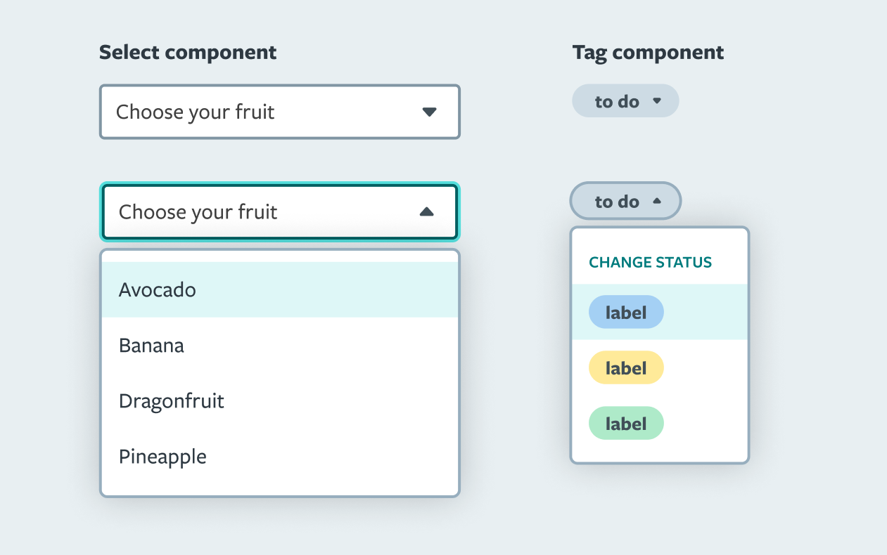

<div align="center">

  

<!-- Badges -->
<p>
  </br>
  <a href="https://github.com/Labcodes/confetti-ds/graphs/contributors">
    
  </a>
  <a href="">
    
  </a>
  <a href="https://github.com/Labcodes/confetti-ds/network/members">
    
  </a>
  <a href="https://github.com/Labcodes/confetti-ds/stargazers">
    
  </a>
  <a href="https://github.com/Labcodes/confetti-ds/issues/">
    
  </a>
  <a href="https://github.com/Labcodes/confetti-ds/blob/master/LICENSE">
    
  </a>
</p>

<h4>
    <a href="https://main--confetti-storybook.netlify.app">View Storybook</a>
  <span> · </span>
    <a href="https://zeroheight.com/8b109e376/p/74e037-confetti">Documentation</a>
  <span> · </span>
    <a href="https://github.com/Labcodes/confetti-ds/issues/">Report Bug</a>
</h4>

</div>

<br />

<!-- Table of Contents -->

# :notebook_with_decorative_cover: Table of Contents

- [About the Project](#star2-about-the-project)
  - [Screenshots](#camera-screenshots)
  - [Tech Stack](#space_invader-tech-stack)
  - [Components](#jigsaw-components)
- [Figma](#art-figma)
- [Getting Started](#toolbox-getting-started)
  - [Prerequisites](#bangbang-prerequisites)
  - [Run Locally](#running-run-locally)
  - [Running Tests](#test_tube-running-tests)
  - [Deployment](#engine-deployment)
- [Usage](#eyes-usage)
- [License](#warning-license)
- [Contact](#handshake-contact)
- [Acknowledgements](#gem-acknowledgements)

<!-- About the Project -->

## :star2: About the Project

Confetti is Labcodes Software Studio's Design System for digital experiences and products. It consists of two component libraries: one for design, in Figma, and another in React, in Storybook.

<!-- Screenshots -->

### :camera: Screenshots

  
  

<!-- TechStack -->

### :space_invader: Tech Stack

- [Figma](https://www.figma.com)
- [Fluent UI Icons](https://github.com/microsoft/fluentui-system-icons)
- [Storybook](https://storybook.js.org/)
- [React](https://reactjs.org/)
- [Turborepo](https://turbo.build/)
- [Netlify](https://www.netlify.com/)

<!-- Components -->

### :jigsaw: Components

- Buttons
- Cards
- Dropdowns
- Tags
- Inputs
- Check box
- Search Bar
- Sidebar
- Alert
- Banner
- Tooltip

<!-- Figma -->
## :art: Figma

Confetti's design specifications can be found on [Figma](https://www.figma.com/file/Wx7jj5klQn3YsRA2XcIV3E/Confetti-%2F-%F0%9F%93%9A-Components?t=wwJ2zxNe5SyHBTlN-6).

<!-- Iconography -->

Nowadays, the Confetti imports some icons from the [Fluent UI](https://github.com/microsoft/fluentui-system-icons) repository. The `@fluentui/react-icons` are listed as a dev dependency, so the usage and the import must follow the Fluent UI guidelines. The all the Confetti icons at size of `20` and with the `Regular` theme as following:

```jsx
  Code20Regular

  (...)

  if (type === "Code") IconComponent = Code20Regular;
```

However, if you wish to import an Icon that is not listed at the Confetti's list you can import it as code below:

``` jsx
import { AccessTimeFilled20Regular } from '@fluentui/react-icons';

```
Hipotetically, you also might need to import an Icon with another size or theme, so you can import as the following example:

``` jsx
import { AccessTime24Filled } from '@fluentui/react-icons';

```

<!-- Getting Started -->

## :toolbox: Getting Started

<!-- Prerequisites -->

### :bangbang: Prerequisites

- [Node](https://nodejs.org/en/)

<!-- Run Locally -->

### :running: Run Locally

Clone the project

```bash
  git clone git@github.com:labcodes/confetti-ds.git
```

Go to the project directory and instal its dependencies

```bash
  npm install
```

<!-- Start the server -->

Starting the server

The project will run at `localhost:8000`

```bash
  npx turbo start
```
Alternatively, you can perform the commands below:

```bash
  cd apps/docs
  npm start
```

<!-- Running Tests -->

### :test_tube: Running Tests

To run tests, run the following command inside at any folder

```bash
  npx turbo test
```

<!-- Rnunning the build-->

### :gear: Running the Build

In order to run the application build, run the following command inside at any folder

```bash
  npx turbo build
```

<!-- Deployment -->

### :engine: Deployment

We use Netlify for running checks for the review apps and deployment.

<!-- CI/CD -->

### :eyes: Continous Deployment

We use the manage of Confetti CI is Github Actions, which runs all the tests before opening a Pull Request. However, the deployment process itself is managed by the Netlify platform. To check our configurations, visit this [link with the configuration file source](https://github.com/labcodes/confetti-ds/blob/main/.github/workflows/ci.yml) and the Netlify [setup file](https://github.com/labcodes/confetti-ds/blob/main/netlify.toml).

<!-- Usage -->

## :eyes: Usage

You can install and use Confetti on your project via `npm`. Instructions on [Confetti's package README](packages/confetti-ds/README.md).

<!-- License -->

## :warning: License

Distributed under the MIT License. See [LICENSE](LICENSE) file for more information.

<!-- Contact -->

## :handshake: Contact

Labcodes Software Studio - [Linkedin](https://www.linkedin.com/company/labcodes/) - contato@labcodes.com.br

<!-- Acknowledgments -->

## :gem: Acknowledgements

- [Confetti Documentation](https://confetti.labcodes.com.br)
- [Shields.io](https://shields.io/)
- [Awesome README](https://github.com/matiassingers/awesome-readme)
- [Emoji Cheat Sheet](https://github.com/ikatyang/emoji-cheat-sheet/blob/master/README.md#travel--places)
- [Readme Template](https://github.com/othneildrew/Best-README-Template)
